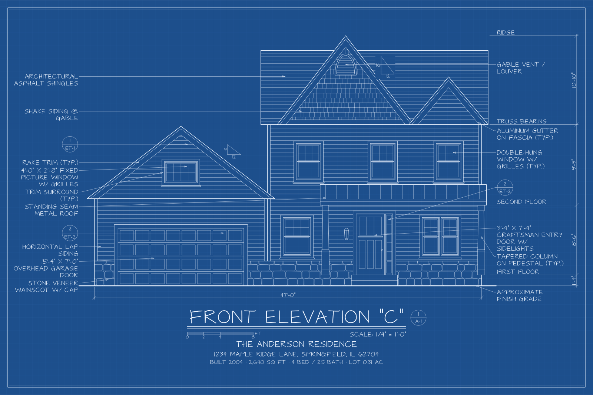
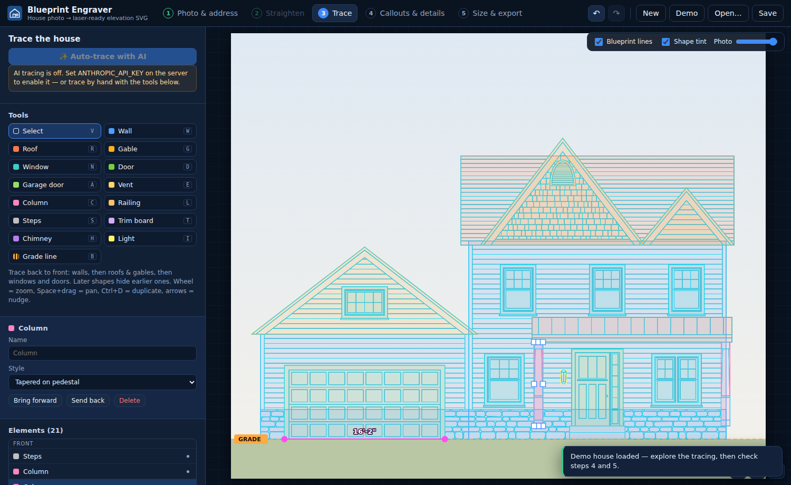

# Blueprint Engraver

Turn a photo of a house into an architectural **front-elevation blueprint** — to scale, with
callouts, level lines and a title block — and export an SVG that engraves cleanly on an
**xTool** (or any) laser.



## What it does

1. **Photo & address** — upload a photo of the front of the house and (optionally) look up the
   address in public records: official address, coordinates, ground elevation, the building
   footprint from OpenStreetMap (for the real facade width), and — with an API key — assessor
   data such as year built, square footage, beds/baths, lot size and parcel number. Tick which
   facts to print under the title.
2. **Straighten** — drag four corners onto a rectangle on the front wall. The app estimates the
   rectangle's true proportions from the perspective, warps the photo so the facade is
   face-on, and (if you enter a known width) sets the drawing scale at the same time.
3. **Trace** — outline walls, roofs, gables and chimneys as polygons and drop boxes on windows,
   doors, garage doors, vents, columns, railings, steps, trim and lights. Each element has
   architectural options (siding type, grilles, door style, sidelights, garage panels, shutters…).
   The generated blueprint linework is overlaid on the photo so you can check alignment.
   Optionally let **Claude** do a first pass with “Auto-trace with AI”.
4. **Callouts & details** — callouts with leader arrows are generated from the tracing
   (“ARCHITECTURAL ASPHALT SHINGLES”, “16'-0" x 7'-0" OVERHEAD GARAGE DOOR”, “STONE VENEER
   WAINSCOT W/ CAP”…). Edit the wording, hide any, add your own notes, and adjust the level lines
   (FIRST FLOOR, SECOND FLOOR, TRUSS BEARING, RIDGE).
5. **Size & export** — pick the board (presets for common boards and xTool work areas). The app
   chooses the largest **standard architectural scale** that fits (e.g. 1/8" = 1'-0",
   1/4" = 1'-0", or metric 1:50), so the scale note, graphic scale bar and dimensions are exact on
   the finished piece. Download the laser SVG, a blueprint-blue SVG, or a 300 dpi PNG proof.



## Quick start

```bash
npm install
cp .env.example .env      # optional — add API keys (see below)
npm run dev               # http://localhost:5173
```

Click **Demo** in the header to load a sample house and explore every step without a photo.

Production:

```bash
npm run build
npm start                 # serves dist/ and the API on $PORT (default 5173)
```

or with Docker: `docker build -t blueprint-engraver . && docker run -p 8080:8080 --env-file .env blueprint-engraver`.

> If you host it publicly, remember that **Auto-trace** spends your Anthropic credits. The server
> rate-limits per IP, but put it behind a login (or leave `ANTHROPIC_API_KEY` unset) if strangers
> can reach it.

### Configuration (`.env`, all optional)

| Variable | Enables |
|---|---|
| `ANTHROPIC_API_KEY` | “Auto-trace with AI” (Claude vision). Default model `claude-opus-5`; override with `CLAUDE_MODEL`. |
| `RENTCAST_API_KEY` | Assessor data via [RentCast](https://www.rentcast.io/api) (free developer tier). |
| `ATTOM_API_KEY` | Assessor data via [ATTOM](https://api.developer.attomdata.com) (used if RentCast isn't set). |
| `CONTACT_EMAIL` | Sent in the User-Agent to OpenStreetMap services, as their usage policy asks. |
| `PORT` | Server port. |
| `AI_TRACES_PER_HOUR`, `LOOKUPS_PER_HOUR` | Per-IP rate limits (defaults 20 and 60). |

Without any keys the app still works end to end: you trace by hand, and the address lookup uses
the free sources (US Census geocoder, OpenStreetMap Nominatim + Overpass, USGS elevation).

## Getting an accurate scale

The drawing is only as accurate as its scale reference. In step 3 → **Scale**:

- **Standard doors** (default): assumes a 6'-8" entry door and a 7'-0" garage door. Good to a few
  percent on typical US houses.
- **Measured line**: draw a line along anything you know the length of (a garage door, a window
  you measured, the wall width) and type the length. Most accurate.
- **Facade width**: uses the wall-to-wall width — for example the street-facing width of the
  building footprint found by the address lookup.

A known width typed in the **Straighten** step also sets a measured reference automatically.
Photos taken straight on, from farther away with a longer lens, straighten best; very wide-angle
phone shots up close exaggerate perspective.

## Engraving on an xTool

The laser SVG is designed to import cleanly into **xTool Creative Space** (and LightBurn):

- Real-world size: `width`/`height` are in **millimetres** and 1 SVG unit = 1 mm, so the design
  should import at exactly the board size you chose (check the size readout after importing).
- **Only stroked paths** — no fills, bitmaps, `<text>`, transforms or CSS. All lettering is drawn
  with **single-line (engraving) fonts**, so each letter is one clean pass in *Score* mode.
- Overlapping lines are merged, so nothing gets burned twice.
- Each line weight is its own colour and group, so you can give outlines more power than
  hatching to get real drafting line weights:

  | Colour | Group | Contents |
  |---|---|---|
  | black `#000000` | Outlines | building silhouette, roof/wall edges, grade line, frame |
  | blue `#0000FF` | Details | windows, doors, trim, fascia, columns |
  | green `#00A000` | Hatching | siding, shingles, brick, stone, grilles |
  | magenta `#FF00FF` | Annotation lines | leaders, dimension and level lines |
  | orange `#FF8000` | Lettering | all text |
  | red `#FF0000` | Cut line | optional plaque outline (rectangle or rounded) |

  Prefer one setting for everything? Choose **Laser colours → Everything black**.
- Hatch spacing is automatically thinned so parallel lines stay at least **Min line gap**
  (0.9 mm by default) apart and don't char together; raise it for softer woods.

Typical workflow in XCS: import the SVG → select the drawing → set processing to **Score** →
adjust power/speed per colour → run a test on scrap → engrave. Set the red outline to **Cut** if
you want the plaque cut out.

## Public records & privacy

The lookup runs on your server. It never reads or prints owner names — only facts about the
building. OpenStreetMap footprints are © OpenStreetMap contributors (ODbL); Census and USGS data
are public domain; RentCast/ATTOM data is subject to their terms.

## AI auto-trace

With `ANTHROPIC_API_KEY` set, **Auto-trace with AI** sends the straightened photo (downscaled to
2000 px) to Claude with a structured-output schema and turns the response into editable elements.
Server-side refusal fallbacks are enabled (`fallbacks: "default"`), so if the model declines a
request the API retries on Anthropic's recommended fallback model. Treat the result as a first
draft — drag corners to match the photo exactly.

## Development

```bash
npm test          # unit tests (geometry, fonts, renderer, address parsing, AI mapping)
npm run typecheck
npx tsx scripts/render-demo.ts out/   # render the demo house to SVG from the command line
```

```
server/            Express app: /api/config, /api/property, /api/analyze (Vite middleware in dev)
  property/        Census + Nominatim geocoding, OSM footprint analysis, USGS elevation, RentCast/ATTOM
  analyze.ts       Claude vision tracing with structured outputs
src/lib/
  geometry/        vectors, polygons, clipping & hatching, homography + perspective aspect estimate
  text/            single-line stroke fonts and text layout
  model/           project types, defaults, scale calibration, level lines, AI/record mapping
  render/          element linework, materials, hidden-line removal, callouts, sheet layout, SVG
  image/           photo import, perspective warp, PNG export
src/components/    React UI for the five steps
```

### Credits

- **EMS Tech** single-line font (SIL OFL 1.1) by Sheldon B. Michaels / Evil Mad Scientist
  Laboratories, derived from *Architects Daughter* by Kimberly Geswein; **Hershey Sans**
  (public domain). See `src/lib/text/fonts/FONTS-LICENSE.md`.
- Perspective aspect-ratio estimation after Zhang & He, *Whiteboard scanning and image
  enhancement* (2007).
